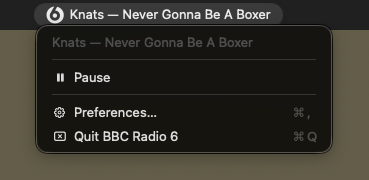

# BBC Radio 6 Music Menu Bar App

A native macOS menu bar app for streaming BBC Radio 6 Music, with Last.fm scrobbling.



## Features

- Streams BBC Radio 6 Music live (320kbps HLS)
- Shows current artist and track in the menu bar
- Last.fm scrobbling via OAuth
- Media key support — pause/play from keyboard
- Volume control

## Requirements

- macOS 13 (Ventura) or later
- Xcode Command Line Tools

## Build

```bash
xcode-select --install   # skip if already installed
git clone https://github.com/tallowandsons/bbc-radio-6-music
cd bbc-radio-6-music
bash build.sh
open 'BBC Radio 6 Music.app'
```

## Last.fm scrobbling

Scrobbling is optional. To set it up:

1. Register an application at [last.fm/api/account/create](https://www.last.fm/api/account/create) to get an API key and secret
2. Open the app → right-click the menu bar icon → **Preferences**
3. Enter your API key and secret
4. Click **Connect Last.fm** — this opens a Last.fm authorisation page in your browser
5. Approve access, return to Preferences, click **I've authorised, complete setup**

## License

MIT

## Credits and notes

Not connected or affiliated with the BBC or Last.fm.

🤖 Shamelessly vibecoded
